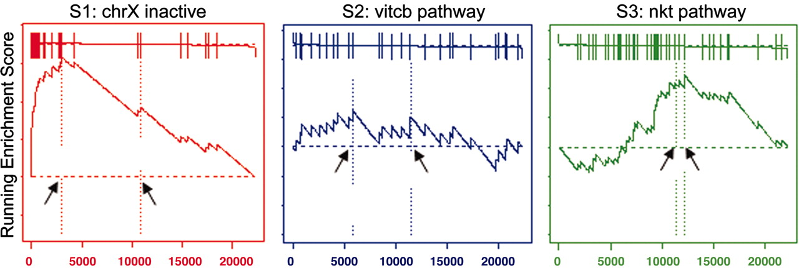

```{r global_options, echo=FALSE}
knitr::opts_chunk$set(fig.width=8,fig.height=6,warning=FALSE, message=FALSE,tidy = TRUE,tidy.opts=list(width.cutoff=50))
```
## 1. Introduction 
Since we don't have any unifying functional themes for the proteins in our analysis, we use Gene Set Enrichment Analysis (GSEA) to work out if there are any genesets with which are data aligns. The goal of GSEA is to determine whether members of a gene set S (in our case proteins with p-value < 0.05), tend to occur toward the top (or bottom) of the list L, in which case the gene set is correlated with the phenotypic class distinction. In our case, this list L could be things like "Amino acyl transferase genes", "Unfolded protein response genes" and so on. 

As a process, we would first rank our list of DE genes either by fold change or by p-value or by log odds score (B) and then pick a gene set we are interested in comparing it to eg: AAtransferases. We start at the top of our ranked list. If the protein at the top of our list is in the AAtransferase list, then a positive number gets added to the running total score. Then we move to the next protein and if that one is also in the AAtransferase list, the score goes up, else the score goes down. Hence you see the craggy peaks in the line graphs depicted below. Each vertical bars that cuts the flat line at the top represents a protein/gene from our list that belongs to the gene set of interest. 

 

GSEA then provides an enrichment score which reflects the extent to which our dataset is represented at the start (top) or end (bottom) of the list L. If we see majority of our genes are  
1. at the top of a list, then the score is high and we can say that our list is significantly enriched for that term (S1 above)  
2. at the bottom of a list, then our data is significantly depleted for that term  
3. scattered randomly, then the score is generally low and we have no significant enrichment (S2 above)   
4. in the middle of the list but enriched, then the score is lower than at when at either end of the list and may not be significant (S3 above)  

The enrichment score is then normalised and a significance level for the enrichment score is derived using permutation testing. This significance level is then corrected for multiple-hypotheses. Overall we get an enrichment score(ES), a normalised enrichment score (NES), a pvalue (pva), an adjusted pvalue (padj) which we can use to interpret the data.

```{r 00_Functions-libraries-needed, eval=T, echo=F, warning=F}

# Libraries
library(tidyr)
library(dplyr)
library(gage)
library(fgsea)
library(ggplot2)
#library(wgutil)
library(ggrepel)
library(gridExtra)

#-------------------------------------------------------------
# Function  : plot_foi_trends
# Aim       : Function to plot Features of Interest (foi)
# Input
#     de    : object as a result of differential expression analysis
#     obj   : a list of go terms with proteins that map to them
#     foi   : feature of interest (usually a GO term definition : 'regulation of translation')
#     ranks : genes from our dataset ranked by order of logFC/p-val,log-odds etc.
#--------------------------------------------------------------
plot_foi_trends <- function(de, obj, foi, ranks){
  print(foi)
  foi_proteins <- obj[[foi]]
  #print(foi_proteins)
  
  # Subset stats for the list of proteins
  sub <- de %>%
    mutate(sig=ifelse(adj.P.Val<0.1, "sig.", "not sig.")) %>% # add "sig" column
    mutate(foi=Master.Protein.Accessions %in% foi_proteins) %>%
    arrange(foi)
  
  sub$gene.name = gsub(" ","",sapply(strsplit(sub$Master.Protein.Descriptions,"GN=|PE"),"[[",2))
  
  # ggplot object  
  p = ggplot(sub, aes(logFC, -log10(P.Value), colour=sig, shape=foi)) +
    geom_point() +
    scale_colour_manual(values=c("darkturquoise","orchid"),name="Sig. (10% FDR)") +# manually adjust colours
    scale_shape_manual(values=c(17,8),name="Feature of Interest") +
    scale_size_manual(values=c(2,4))+
    theme(legend.position = "top")+
    my_theme+
    ggtitle(foi)
  
  # Add gene names
  p = p+geom_text_repel(data=sub %>% filter(Master.Protein.Accessions %in% foi_proteins & sig=="sig."), aes(label=gene.name), size=3,colour="black")
  
  # Create GSEA line graph
  q = plotEnrichment(obj[[foi]], ranks) + ggtitle(foi)
  
  # Plot both graphs
  grid.arrange(p,q,nrow=1,ncol=2)
}

#-------------------------------------------------------------
# Function  : plotRanksEnrich
# Aim       : Function to plot ranking of our genes and gene set enrichment
# Input
#     obj   : a list of go terms with proteins that map to them
#     ranks : genes from our dataset ranked by order of logFC/p-val,log-odds etc.
#     pre   : prefix for output file
#--------------------------------------------------------------
plotRanksEnrich<-function(obj,ranks,pre,n=10){
  # Plot log fold changes
  # Can see genes at both ends of spectrum - up and downregulated after arsenite treatment. 
  # We have the up-regulated ones at the top. 
  
  pdf(paste("../plots/",paste(pre,"Ranked-enrichment-data.pdf",sep="_"),sep=""),paper="a4r",width=14,height=8)
  par(mfrow=c(1,2))
  barplot(ranks,las=2,cex.names=0.1)
  plot(ranks)
  par(mfrow=c(1,1))
  
  # Run a pre-ranked GSEA against all known GO terms
  fgseaRes <- fgsea(obj, ranks, minSize=15, maxSize = 500, nperm=1000)
  head(fgseaRes[order(pval, -abs(NES)), ], n=10)
  
  # Select the top-10 go terms and plot enrichment for them
  head(fgseaRes[order(pval, -abs(NES)), ], n=10)$pathway %>% lapply(function(x){
    plotEnrichment(obj[[x]], ranks) + ggtitle(x)
  })
  dev.off()
  
  barplot(ranks,las=2,cex.names=0.1)
  plot(ranks)
  head(fgseaRes[order(pval, -abs(NES)), ], n=n)$pathway %>% lapply(function(x){
    print(plotEnrichment(obj[[x]], ranks) + ggtitle(x))
  })
  
  return(fgseaRes)
}

#-------------------------------------------------------------
# Function  : gseaTab
# Aim       : Function to plot ranking of our genes and gene set enrichment
# Input
#     obj   : a list of go terms with proteins that map to them
#     fgseaRes : data table obtained from running 'fgsea' on your data
#     pre   : prefix for output file
#--------------------------------------------------------------
gseaTab<-function(obj, fgseaRes,ranks,pre){
  topUp <- fgseaRes %>% 
      filter(ES > 0) %>% 
      top_n(10, wt=-pval)
  
  topDown <- fgseaRes %>% 
      filter(ES < 0) %>% 
      top_n(10, wt=-pval)
  
  topPathways <- bind_rows(topUp, topDown) %>% 
      arrange(-ES)
  
  pdf(paste("../plots/",paste(pre,"GSEA-results-table-top-bottom-10.pdf",sep="_"),sep=""),paper="a4r",width=14,height=8)
  x <- plotGseaTable(all_go[topPathways$pathway], gseaParam = 0.5, ranks, fgseaRes)
  dev.off()
}

```
## 2. Reading in data
The first step is to read in data from the previous step of analysis. In our case, we have the results of a differential analysis between Ctrl and 100uM and Ctrl and 400uM Arsenite treated cells. We have approximately 200 proteins that are DE in each comparison. We also open up the full mapping of human proteins to go terms which is saved in the RDS "../shared_files/h_sapiens_go_full.rds".  
```{r 01_Reading-in-data}
limma_results <- readRDS('../results/limma_results_thresholds.rds')
limma_total_results <- readRDS('../results/limma_total_results_thresholds.rds')

human_go <- readRDS("../shared_files/h_sapiens_go_full.rds")
```
## 3. Gene sets of interest

### 3a. Home-made gene sets   
In the first pass of GSEA analysis, we set up some manual gene sets which we'd like to assess ur data against. These include translation initiation, elongation, tRNA aminoacyltransferases etc...

Additionally, we take the list of proteins in our study and map every one of them to their entire GO term repertoire. Having done that, we then reverse the mapping to be centred around each GO terms i.e for each GO term, we get a list of all proteins that are annotated with it. Since this bit of code is time consuming, we save it as an RDS and call on it later as the analysis progresses. 

```{r 02_Setting-up-gene-sets, echo = T}

# Gene sets of interest
translation_init_activity <- human_go %>% filter(GO.ID=='GO:0003743') %>% pull(UNIPROTKB)
translation_elong_activity <- human_go %>% filter(GO.ID=='GO:0003746') %>% pull(UNIPROTKB)
translation_term_activity <- human_go %>% filter(GO.ID=='GO:0008079') %>% pull(UNIPROTKB)
tRNA_AA <- human_go %>% filter(GO.ID=='GO:0004812') %>% pull(UNIPROTKB)
translocon <- human_go %>% filter(GO.ID=='GO:0006616') %>% pull(UNIPROTKB)

cyto_ribosome <- human_go %>% filter(GO.ID=='GO:0022626') %>% pull(UNIPROTKB)
ribosome_structural_component <- human_go %>% filter(GO.ID=='GO:0003735') %>% pull(UNIPROTKB)


# GO terms of interest (gotoi)
gotoi <- list(translation_init_activity, translation_elong_activity,
              translation_term_activity, tRNA_AA, translocon, intersect(cyto_ribosome, ribosome_structural_component))

names(gotoi) <- c('GO_0003743_Initiation', 'GO:0003746:Elongation', 'GO:0008079:Translation', 'GO:0004812:tRNA-AA', 'GO:0006616:Translocon', 'GO:0022626+GO:0003735:Cyt.Ribo.')
print(gotoi)

```
```{r}
ranks0 <- rev(sort(limma_results$Int_0$`400uM`$logFC))
names(ranks0) <- rownames(limma_results$Int_0$`400uM`)
ranks50 <- rev(sort(limma_results$Int_50$`400uM`$logFC))
names(ranks50) <- rownames(limma_results$Int_50$`400uM`)


plotRanksEnrich(gotoi,ranks0,"")
plotRanksEnrich(gotoi,ranks50,"")
  
plot_foi_trends(limma_results$Int_0$`400uM`, gotoi, 'GO:0022626+GO:0003735:Cyt.Ribo.', ranks=ranks0)
plot_foi_trends(limma_results$Int_50$`400uM`, gotoi, 'GO:0022626+GO:0003735:Cyt.Ribo.', ranks=ranks50)
```

```{r, eval = F}
# Gene set for each GO term
# The set of GO terms is same for both Ctrl.400uM and Ctrl.100uM) as it is the same set of proteins that were analysed using TMT

all_go_terms <- human_go %>% filter(UNIPROTKB %in% rownames(Ctrl.400uM)) %>%
  pull(TERM) %>% unique()

all_go <- vector("list", length=length(all_go_terms))
names(all_go) <- all_go_terms

for(x in all_go_terms){
  all_go[[x]] <- human_go %>% filter(TERM==x) %>% pull(UNIPROTKB)
}

print(head(all_go,1))
saveRDS(all_go,"../results/all_go.rds")

# Plot enrichment for our own defined genesets
lapply(gotoi, function(x) plotEnrichment(x, ranks))
```
### 3b. Gene sets based on GO terms

Using 'all_go' which contains and extensive protein map onto GO terms, we perform a GSEA and display the green line graphs for the top 10 hits. We start by ranking out set of proteins based on logFC in either the 100uM or 40-uM arsenite comparison. Plots can be found under "../plots/*Ranked-enrichment-data.pdf"

```{r 03_Gene-set-enrichment-analysis-total, eval=T, echo=T, warning=F}

all_go = readRDS("../results/all_go.rds")

fgseaRes_total <- limma_total_results %>% lapply(function(x){
# Ranking the 100uM dataset using logFC
  ranks.100 <- rev(sort(x$`100uM`$logFC))
  names(ranks.100) <- rownames(x$`100uM`)
  head(ranks.100)
  
  # Ranking the 100uM dataset using logFC
  ranks.400 <- rev(sort(x$`400uM`$logFC))
  names(ranks.400) <- rownames(x$`400uM`)
  head(ranks.400)
  
  # Plots ranked data as well as enrichment
  fgseaRes.100 = plotRanksEnrich(all_go, ranks.100,"Ctrl-vs-100uM-Arsenite-total", n=5)
  fgseaRes.400 = plotRanksEnrich(all_go, ranks.400,"Ctrl-vs-400uM-Arsenite-total", n=5)
  
  return(list('fgseaRes.100'=fgseaRes.100, 'fgseaRes.400'=fgseaRes.400))
})
```

```{r}
fgseaRes <- limma_results %>% lapply(function(x){
# Ranking the 100uM dataset using logFC
  ranks.100 <- rev(sort(x$`100uM`$logFC))
  names(ranks.100) <- rownames(x$`100uM`)
  head(ranks.100)
  
  # Ranking the 100uM dataset using logFC
  ranks.400 <- rev(sort(x$`400uM`$logFC))
  names(ranks.400) <- rownames(x$`400uM`)
  head(ranks.400)
  
  # Plots ranked data as well as enrichment
  fgseaRes.100 = plotRanksEnrich(all_go, ranks.100,"Ctrl-vs-100uM-Arsenite", n=5)
  fgseaRes.400 = plotRanksEnrich(all_go, ranks.400,"Ctrl-vs-400uM-Arsenite", n=5)
  
  return(list('fgseaRes.100'=fgseaRes.100, 'fgseaRes.400'=fgseaRes.400))
})
```


```{r}
fgseaRes_total %>% names() %>% sapply(function(x){
  print(fgseaRes_total[[x]]$fgseaRes.100 %>%arrange(pval) %>% head())
  print(fgseaRes_total[[x]]$fgseaRes.400 %>%arrange(pval) %>% head())
})

fgseaRes %>% names() %>% sapply(function(x){
  print(fgseaRes[[x]]$fgseaRes.100 %>%arrange(pval) %>% head())
  print(fgseaRes[[x]]$fgseaRes.400 %>%arrange(pval) %>% head())
})


```


## 4. Assessing hits
Here we are trying to look at the ranking+enrichment for our terms of interest. We start by looking at which terms are represented in our data

### 4a. Specific pathways
We are looking at specific pathways related to the ribosome, endoplasmic reticulum and translation to see if there are any pathways enriched for in our gene set. There are some that are significant before correcting for multiple hypothesis testing such as  endoplasmic reticulum unfolded protein response (p = 0.01152738),  regulation of translation (p = 0.006944444) and tRNA aminoacylation for protein translation (p = 0.029619182). 
```{r}
for (threshold in names(fgseaRes_total)){
  for (arsenite in names(fgseaRes_total[[threshold]])){
    for (functional_group in c("Ribosome", "Endoplasmic", "Translation")){
      print(c(threshold, arsenite, functional_group))
      print(fgseaRes_total[[threshold]][[arsenite]] %>% arrange(pval) %>%
        filter(grepl(functional_group, pathway, ignore.case=TRUE)))
    }
  }
}
```

```{r 04_Assessing-hits, echo =T, eval=F}
for (threshold in names(fgseaRes)){
  for (arsenite in names(fgseaRes[[threshold]])){
    print(fgseaRes[[threshold]][[arsenite]] %>% arrange(pval) %>% head(10))
    for (functional_group in c("Ribosome", "Endoplasmic", "Translation")){
      print(c(threshold, arsenite, functional_group))
      print(fgseaRes[[threshold]][[arsenite]] %>% arrange(pval) %>%
        filter(grepl(functional_group, pathway, ignore.case=TRUE)))
    }
  }
}


```
### 4b. Plotting enrichment plots for specific pathways
We draw a volcano plot and an enrichment plot showing the terms enriched and the genes that contribute to the enrichment based on the pathways of interest from above.  

In the volcano plots, turquoise represents non-significant proteins and purple represents significant ones after arsenite treatment compared to controls. Asterisk shapes indicate which of these proteins are in the category of interest eg : 'structural constituent of ribosome'. Black labels indicate those proteins that are significantly differentially expressed upon arsenite treatment AND in our pathway of interest. 

In the GSEA plot, along the x-axis, we plot our ranked list of proteins in descending order of log fold-change in expression vs Ctrl. There are 896 such proteins. Then we mark with vertical bars all the locations of proteins that  belong to our geneset of interest. Finally, we follow the GSEA method to draw the green line where the enrichment score is a running sum and goes up or down depending on whether a protein is in the gene set of interest or not. Genesets with early or late peaks are most relevant. This varies in the 100uM vs 400uM treated cells and plots can be found under "../plots/*features-of-interest-volcano-random-walks.pdf"

```{r 4b. Enrichment-plots-for-features-of-interest}

plotGSEAFOI <- function(obj, filename){
# 100uM
  pdf(filename,paper="a4r",width=14,height=8)
  for (term in c('regulation of translation',
                 'tRNA aminoacylation for protein translation',
                 'cytosolic ribosome',
                 'endoplasmic reticulum unfolded protein response')){
  ranks <- rev(sort(obj$logFC))
  names(ranks) <- rownames(obj)
  plot_foi_trends(obj, all_go,term, ranks)
  }
  dev.off()
}

for (threshold in names(limma_total_results)){
  for (arsenite in names(limma_total_results[[threshold]])){
    filename <- sprintf(
      "../plots/Ctrl-vs-%s-Arsenite_%s_total_GSEA-features-of-interest-volcano-random-walks.pdf",
      arsenite, threshold)
    plotGSEAFOI(limma_total_results[[threshold]][[arsenite]], filename)
    
  }
}

for (threshold in names(limma_results)){
  for (arsenite in names(limma_results[[threshold]])){
    filename <- sprintf(
      "../plots/Ctrl-vs-%s-Arsenite_%s_GSEA-features-of-interest-volcano-random-walks.pdf",
      arsenite, threshold)
    plotGSEAFOI(limma_results[[threshold]][[arsenite]], filename)
    
  }
}


```
```{r, fig.width=6, fig.height=6}
my_plot_foi_trends <- function(obj, functional_groups, foi, foi_name, title){
  ranks <- rev(sort(obj$logFC))
  names(ranks) <- rownames(obj)
  
  foi_proteins <- functional_groups[[foi]]
  #print(foi_proteins)
  
  # Subset stats for the list of proteins
  sub <- obj %>%
    mutate(foi=Master.Protein.Accessions %in% foi_proteins) %>%
    arrange(foi)
  
  sub$gene.name = gsub(" ","",sapply(strsplit(sub$Master.Protein.Descriptions,"GN=|PE"),"[[",2))
  
  max_p_sig <- sub %>% filter(adj.P.Val<0.1) %>% pull(P.Value) %>% max()
  
  
  # ggplot object  
  p <- sub %>% arrange(foi) %>%
    ggplot(aes(logFC, -log10(P.Value), colour=foi, shape=foi, size=foi, alpha=foi)) +
    geom_point() +
    geom_hline(yintercept=-log10(max_p_sig), linetype=2, colour='grey50') +
    geom_vline(xintercept=-0.5, linetype=2, colour=cbPalette[4], alpha=0.5) +
    geom_vline(xintercept=0.5, linetype=2, colour=cbPalette[4], alpha=0.5) +
    scale_colour_manual(values=cbPalette,name=foi_name) +# manually adjust colours
    scale_shape_manual(values=c(20,2),name=foi_name) +
    scale_size_manual(values=c(0.5,2), guide=FALSE) +
    scale_alpha_manual(values=c(0.25, 1), guide=FALSE) +
    geom_text_repel(data=sub %>% filter(Master.Protein.Accessions %in% foi_proteins & adj.P.Val<0.1), 
                    aes(label=gene.name), size=3, colour="black") +
    ggtitle(title) +
    my_theme
  
  # Create GSEA line graph
  q <- plotEnrichment(functional_groups[[foi]], ranks) +
    ggtitle(title)
  
  p2 <- sub %>%
    ggplot(aes(logFC, colour=foi)) +
    geom_density() +
    scale_colour_manual(values=cbPalette,name=foi_name) +
    ggtitle(title) +
    my_theme
    
  # Plot both graphs
  print(p)
  print(p2)
  print(q)
}
  
for(threshold in names(limma_total_results)){
  for(arsenite in names(limma_total_results[[threshold]])){
    my_plot_foi_trends(limma_total_results[[threshold]][[arsenite]],
                       gotoi, 'GO:0022626+GO:0003735:Cyt.Ribo.',
                       'Cyt. Ribo.', title=paste(threshold, arsenite, sep="_"))
  }
}

print(length(gotoi[['GO:0022626+GO:0003735:Cyt.Ribo.']]))
print(length(all_go[['cytosolic ribosome']]))
```
```{r}
for(threshold in names(limma_results)){
  for(arsenite in names(limma_results[[threshold]])){
    my_plot_foi_trends(limma_results[[threshold]][[arsenite]],
                       all_go, 'protein export from nucleus',
                       'Trasnscriptional neg. reg.', title=paste(threshold, arsenite, sep="_"))
  }
}

```


```{r}
#colnames(limma_total_results[[threshold]][[arsenite]] )

limma_total_results$Int_0$`400uM` %>%
  filter(Master.Protein.Accessions %in% all_go[['cytosolic large ribosomal subunit']]) %>%
  select(Master.Protein.Accessions, logFC, P.Value, adj.P.Val, Master.Protein.Descriptions) %>%
  arrange(desc(logFC))
```


### 4c. Overall enriched/depleted genesets

