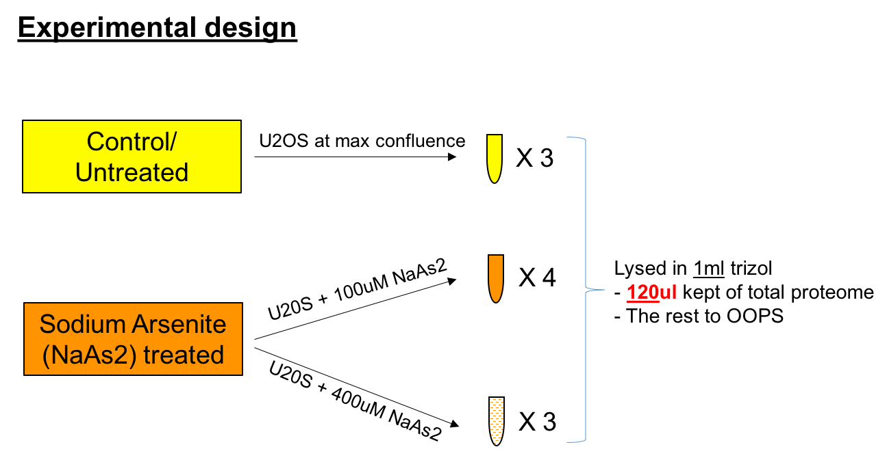

```{r global_options, echo=FALSE}
knitr::opts_chunk$set(fig.width=12,fig.height=8,warning=FALSE, message=FALSE,tidy = TRUE,tidy.opts=list(width.cutoff=50))
```
## 1. Introduction  
This is an experiment by Eneko and Rayner testing the effects of sodium arsenite (NaAs2) treatment on U2OS osteosarcoma cell lines. Sodium arsenite is an appropriate chemical stressor to induce the production of heat shock proteins, and the formation of cytoplasmic stress granules. 

Cells were either left untreated, treated with 100uM NaAs2 or treated with 400uM NaAs2. There 3 replicates for each condition except the 100uM setting which has 4. Each of these samples has undergone OOPS to obtain Total proteome (organic phase) and RBPome (interphase). The proteins set has been analysed on the mass spectrometer using a 10-plex TMT experiment. Here, we would like to assess the differences in RNA-binding proteins, if any, in (1) 100uM NaAs2 treatment vs Control and (2) 400uM NaAS2 treatment vs control (3) 100uM NaAs2 vs 400uM NaAs2.  

In the following lines of code, we will:  
 1. Look the raw data  
 2. Filter data to remove those mapping to multiple proteins  
 3. Aggregate the data into protein-level quantification  
 4. Filter the data to remove contaminants  
 5. Normalise the data (if needed)  
 6. Perform QC checks  
 7. Look for differentially expressed RBPs across conditions  
 8. Look for GO term enrichment in the differential RBPs  



***

We start by installing and loading the libraries required for our analysis. Make sure you have downloaded the GitHub repository https://github.com/TomSmithCGAT/CamProt_R locally. Also make sure you are in the directory that contains the Rmd notebooks prior to running this code, otherwise program will not run. Raw data is in the folder "../raw", plots will be printed out to the folder "../plots" and results in the form of tables will be printed out to the folder "../results". Large annotation files necessary for GO term enrichment are in the folder "../shared_files". 

```{r 00_Startup}

# Libraries needed for analysis
suppressMessages(library(MSnbase))
suppressMessages(library(dplyr))
suppressMessages(library(gridExtra))

# source file that contains useful functions for analysis
source("../../CamProt_R/Utility.R", chdir=TRUE)

# Source file that contains a list of glycoproteins that have been identified in previous OOPS experiments. I'm not convinced about removing these proteins from the study at the ourset.
glycoproteins <- read.table("../shared_files/glycoproteins.tsv", sep="\t", header=TRUE)
glycoproteins <- glycoproteins %>% pull(protein) %>% as.character() %>% unique()
```

```{r 01_Functions, eval = T, echo = F}

# A set of functions needed within this script.

#--------------------------------------------------------
# Function  : run_parse_features
# Aim       : Function-to-parse-features-for-all-data
#--------------------------------------------------------

run_parse_features <- function(fname){
  
  df = parse_features(fname,master_protein_col='Master.Protein.Accessions',protein_col='Protein.Accessions')
  df_noglyc = df[!df$Master.Protein.Accessions %in% glycoproteins,]
  
  cat(sprintf("%s\tExcluding glycoproteins\n", length(rownames(df_noglyc))))
  cat(sprintf("\nThese peptides are associated with %s master proteins\n", 
              length(unique(df_noglyc$Master.Protein.Accessions))))
  
  return(list(df = df, df_noglyc = df_noglyc))
}

#----------------------------------------------------------------------------------
# Function  : assess_rbp_tot_overlap
# Aim       : quantify overlap between total protein and rbp (oops) experiments
#----------------------------------------------------------------------------------
assess_rbp_tot_overlap <- function(rbp_df, tot_df, suf){
  print(paste("RBP master proteins also in total",suf,"=",length(intersect(unique(tot_df$Master.Protein.Accessions),
                               unique(rbp_df$Master.Protein.Accessions))),sep=" "))
  print(paste("RBP master proteins NOT in total",suf,"=",
              length(setdiff(unique(rbp_df$Master.Protein.Accessions),
                             unique(tot_df$Master.Protein.Accessions)))))
  
  print(paste("Percentage RBP master proteins in total",suf,"=",round(length(intersect(unique(tot_df$Master.Protein.Accessions),unique(rbp_df$Master.Protein.Accessions)))*100/length(unique(rbp_df$Master.Protein.Accessions)),2),"%"))
}

#----------------------------------------------------------------------------------
# Function  : summariseMissing
# Aim       : print tally of missing values for each study across all peptides/prots
# Input     : 
#----------------------------------------------------------------------------------
summariseMissing <- function(res){
  #cat("\ntallies for missing data (# samples with missing)")
  print(table(rowSums(is.na(as.data.frame(exprs(res)))),dnn = "Number of peptides VS samples with missing values"))
}


#----------------------------------------------------------------------------------
# Function  : plotLabelQuant
# Aim       : Plot peptide abundance distributions for mass spectrometry data
# Input     : obj = MSnSet object
#           : log = Should plotting values be logged - TRUE or FALSE
#           : print = SHould plot be printed to screen or not
#           : suf = title suffix
#----------------------------------------------------------------------------------
plotLabelQuant <- function(obj, log=F, print=TRUE,suf){
  tmp_df <- data.frame(exprs(obj))
  colnames(tmp_df) <- pData(obj)$Sample_name
  tmp_df[tmp_df==""] <- NA
  tmp_df <- melt(tmp_df, id.vars=NULL)
  tmp_df$value <- as.numeric(as.character(tmp_df$value))
  
  if(log){
    tmp_df$value = log(tmp_df$value,2)  
  }
  
  # Plotting functions
  p <- ggplot(tmp_df) + my_theme
  
  p1 <- p + geom_boxplot(aes(variable, value)) +
    theme(axis.text.x=element_text(angle=90, vjust=0.5, hjust=1,size=10),axis.title.y = element_text(size = 12), title = element_text(hjust = 0.5, vjust=0.5)) +
    ylab("Peptide intensity (log2) ") + xlab("") +
    scale_y_continuous(breaks=seq(-100,100,2))+ggtitle(suf)
  
  p2 <- p + geom_density(aes(value, col=variable),na.rm=T) +
    xlab("Peptide intensity (log2) ") + ylab("Density")+theme_classic()+theme(axis.title.y = element_text(size = 12),axis.title.x = element_text(size = 12),legend.title = element_text(size = 10),legend.position = c(0.9,0.5),legend.text = element_text(size = 8))+labs(col = "")+guides(color = guide_legend(override.aes = list(size = 0.4)))+scale_x_continuous(breaks=c(0,3,6,9,12))+ggtitle(suf)
  
  p3 = arrangeGrob(p1,p2,nrow=1)
  
  if(print){
    plot(p3)
  }
  
  return(list("p1"=p1, "p2"=p2, "p3"=p3))
}

#----------------------------------------------------------------------------------
# Function  : plotPepCounts
# Aim       : Plot distribution of peptide count per protein
# Input     : res_pep_agg = peptide level mass spectrometry data as an MSnSet
#           : suf = title suffix
#----------------------------------------------------------------------------------
plotPepCounts <- function(res_pep_agg,suf){
  fData(res_pep_agg) <- fData(res_pep_agg)[,-grep("CV.*", colnames(fData(res_pep_agg)))]
  
  gb <- fData(res_pep_agg)$Master.Protein.Accessions
  gb <- factor(gb, levels = unique(gb))
  peptide_counts <- as.data.frame(table(gb))
  
  print(sprintf("Out of %s master proteins, we have %s one-hit wonder proteins (%s %%)",
                length(unique(gb)), sum(peptide_counts==1),
                round(100*sum(peptide_counts==1)/length(unique(gb)), 1)))
  
  titl = paste(suf,paste(unique(sapply(strsplit(pData(res_pep_agg)$Sample_name,"_"),"[[",1)),collapse=".vs."),sep=": ")
  p <- ggplot(peptide_counts, aes(log(Freq,2))) + geom_histogram() + my_theme +theme(axis.title.x=element_text(size=12),axis.title.y = element_text(size = 14),plot.title=element_text(hjust=0.5,vjust=1,size=18))+xlab("Log2(Number of peptides)")+ylab("Number of proteins")+labs(title = titl)
  return(p)
}

```
## 2. Read in the peptide-level quantification  
What we obtain following a mass spectrometer run is peptide-level quantification from Proteome Discoverer(PD). Here we perform some Quality Control checks before aggregating data to protein-level quantification. 

As discussed before, there are a single dataset to be analysed :  
a. Control vs Sodium Arsenite (100uM, 400uM) treatment

The function 'parse_features' reads in a peptide-level data file and processes it remove any contaminants, peptides missing a protein assignment and those that are missing quantification values (details in 'Utility.R'). 

```{r 02_Peptide-level-quantification}

# Parsing input files
files = grep("reannot",list.files("../raw",full.names = T),value=T)
suff = gsub("_reannot.txt|_peptides","",sapply(strsplit(files,"/"),"[[",3))

# Process all experimental data
for(f in 1:length(files)){
  print(toupper(suff[f])) 
  r = run_parse_features(files[f])
  assign(paste(suff[f],"df",sep="_"),r$df)
  assign(paste(suff[f],"df_noglyc",sep="_"),r$df_noglyc)
}

# List objects that have been created
grep("df",ls(),value=T)

# Summarise the number of RBPs and Total proteins in each set of experiments

# 1. Control vs Arsenite treated
assess_rbp_tot_overlap(rbp_arsenite_df, total_arsenite_df, "Control-vs-Arsenite")

```
In the experiment, nearly 80% of RBPs are also in the total samples. For most of the RBPs we will also have information regarding the changes in the total abundance for the protein, regardless of the abundance of the RNA-bound fraction. However, for 20-30% of them, we won't. 

## 3. Creating and working with MSnSets
First we create the dataframes to make an MSnSet object. It is based on a microarray eSet or ExpressionSet where the object contains slots with information and during data processing, the functions that work with MSnSets handle data within these slots as they expect very specific data types. The MSnSet has 3 main slots.  
a. exprs : Contains a dataframe of protein abundance values with samples in columns and proteins/peptides in rows  
b. fData : (feature Data)Contains annotation information about each of the proteins/peptides in the exprs dataframe. Can also include abundance information
c. pData : (phenotype Data) Contains annotation information about each sample in the exprs dataframe. Condition, replicate number, treatment type are all valid pieces of information.  

```{r 03_Creating-an-MSnSet-from-data}

# Read in experimental set-up data
samples_as_inf <- "../raw/samples.tsv"

total_as_res <- makeMSNSet(total_arsenite_df, samples_as_inf)
rbp_as_res <- makeMSNSet(rbp_arsenite_df, samples_as_inf)

# Check relative quantification in data
q1 <- plotLabelQuant(total_as_res, log=T,print=F,suf="Total")
q2 <- plotLabelQuant(rbp_as_res, log=T,print=F,suf="RBP")

# Boxplots of raw data
g = grid.arrange(q1$p1,q2$p1,ncol=2)
grid.arrange(q1$p2,q2$p2,ncol=2)
```

Once we've created MSnSets, we look at the distribution of abundance values on a per-sample basis keeping in mind that it is currently at the level of peptides. From the plots on the left (Total protein), the trend seems to be that there is higher expression of proteins in the control, a drop in the 100uM Arsenite treatment and a slight increase in expression in the 400uM treatment. This trend is similar in the RBP experiment (right side plot) with the overall expression being lower than in the total proteome and having a few more extreme outliers.

The density curves of each treatment are shifted away from each other (squint a little bit!) but overall the samples all follow a very normal distribution. No problematic samples can be identified.

### 3a. Aggregating over peptides
If you look at the fData slot in the MSnSets above, you will see that there is a column called "Sequence" that contains the sequence of the peptide whose abundance has been measured. Interestingly, there are some repeats of these sequences for the same protein that only differ in their Modifications i.e any amino acid modifications that the mass spectrometer has picked up. We will first aggregate over the peptides with the same sequence but different modifications so that we only have one peptide representing a given sequence. The abundance values are summed across different modifications. Note: Don't worry about the errors. Missing values are correctly handled here!!

```{r 3i_Aggregating-over-peptides}

# Aggregate to peptides
total_as_res_pep_agg <- agg_to_peptides(total_as_res)
rbp_as_res_pep_agg <- agg_to_peptides(rbp_as_res)

# Summarise missing values
summariseMissing(total_as_res_pep_agg)
summariseMissing(rbp_as_res_pep_agg)

# Save to RDS files for downstream use
saveRDS(total_as_res_pep_agg, file="../results/total_as_res_pep_agg.rds")
saveRDS(rbp_as_res_pep_agg, file="../results/rbp_as_res_pep_agg.rds")

```
You might have noticed that while we created the MSnSet, we also did a tally for how many samples had missing values across all of the peptides. Across the four studies, the number of peptides missing all 10 values in the 10-plex is shown in the table below. 

Experiment  | Raw peptide data | Aggregated peptide data  | 
------------|---------------------|-------------------------------------|
Control vs NaAs2 | 1113 peptides |0 peptides |
Control vs NaAs2  | 898 peptides |0 peptides |

Once we aggregate across modifications, there are no peptides where all 10 values are missing. They must have all been peptides with two or more alternate modifications that have now been rolled into one. However, there are still a small number of peptides that have some missing values but mostly in one or 2 samples only as shown in the plot below. The grey bars display missing values and black display non-missing values.The plots only display those peptides with one or more missing values. Peptides with no missing values are not shown. Missing values are only affecting treated samples, not control ones.

```{r 3ii-Plot-missing-data-at-peptide-level}

names = c("TotalProt-Control-vs-NaAs2-Treated","RBPs-Control-vs-NaAs2-Treated")
c = 1

pdf("../plots/Missing-value-heatmaps-peptide-level-data.pdf",paper="a4r",width=14,height=8)

for(i in list(total_as_res_pep_agg,rbp_as_res_pep_agg)){
  if(length(summariseMissing(i))>=3){
    plotMissing(i,cexCol=0.8,srtCol=45,main = names[c])
  }
  c = c+1
}
dev.off()
```

Since we want to aggregate peptides into proteins, we check initially to see how many peptides we have per protein. We are particularly interested in the proportion of "one-hit" or "single-hit" across the samples as these would generally be low-confidence finds. 

```{r 3iii-Plot-peptide-vs-protein-count}

# Use function 'plotPepCounts' to plot distribution over peptide level data
p1=plotPepCounts(total_as_res_pep_agg,"Total")
p2=plotPepCounts(rbp_as_res_pep_agg,"RBP")

pdf("../plots/Distribution-of-peptides-per-protein.pdf",paper="a4r",width=14,height=8)
grid.arrange(p1,p2,ncol=2)
dev.off()
```
So we have 37-42% "one-hit" wonders across the experiments (Total (37.3%),RBP (42.2%). We'll leave these in for now as we'd be taking 40% of the data out if we deleted them but we could consider excluding these as we have less confident abundance estimates here. 

### 3b. Aggregating over proteins
Having aggregated across peptides with multiple modifications, we now was an abundance value per protein per samples. To achieve this, we need to aggregate again, this time using Uniprot IDs to identify all peptides that belong to a single protein and summing abundance values across these peptides to get a single value for a given protein. Following this, we once again do a tally for missing values at the protein level. 

```{r 3iv-Aggregating-over-proteins}

# Aggregate to protein
total_as_res_pro_agg <- agg_to_protein(total_as_res_pep_agg, "Master.Protein.Accessions")
rbp_as_res_pro_agg <- agg_to_protein(rbp_as_res_pep_agg, "Master.Protein.Accessions")

# Summarise missing values
summariseMissing(total_as_res_pro_agg)
summariseMissing(rbp_as_res_pro_agg)
```
Note, we're now down to 2 samples with missing values across 3 proteins. Since there are only 3 proteins with missing values, it isn't worth imputing so we remove these proteins entirely as it doesn't make much of a difference. These proteins are P36406 (TRI23_HUMAN, E3 ubiquitin-protein ligase TRIM23) and Q96A35 (RM24_HUMAN,39S ribosomal protein L24, mitochondrial) in the total proteome and P13804 (ETFA_HUMAN, Electron transfer flavoprotein subunit alpha, mitochondrial) in the RBPome.  

```{r 3v-Remove-missing-data-at-protein-level}

total_as_res_pro_agg = total_as_res_pro_agg[-which(rowSums(is.na(exprs(total_as_res_pro_agg))) > 0)]
rbp_as_res_pro_agg = rbp_as_res_pro_agg[-which(rowSums(is.na(exprs(rbp_as_res_pro_agg))) > 0)]

saveRDS(total_as_res_pro_agg, file="../results/total_as_res_pro_agg.rds")
saveRDS(rbp_as_res_pro_agg, file="../results/rbp_as_res_pro_agg.rds")

```


### 3c. Normalising data
Next, we log center normalise the data. The total amount of peptide labelled in each sample should be the same so we can assume any difference in the total intensity per tag is due to inaccuracies in peptide quantification prior to labelling, pipetting etc, or non-identical labelling efficiencies. Whatever the cause, we can normalise the tags since we want to obtain a relative measure between tags. 

So we log centre normalise the data first. This leaves us with the median abundance for each sample at 0 and values below or above median for the proteins analysed in that samples. To these values, we add the median of all protein abundance values (a constant) which then shifts the range of values into the positive range making it more interpretable. The plots below show protein abundance data before and after normalisation.

```{r 3vii-Normalise-data}

# Median central normalise
total_as_res_pro_agg_norm <- logCenterNormalise(total_as_res_pro_agg)
exprs(total_as_res_pro_agg_norm) <- exprs(total_as_res_pro_agg_norm) + median(log2(exprs(total_as_res_pro_agg)),na.rm=T)
pData(total_as_res_pro_agg_norm)$Sample_name = gsub("\\_Arsenite","-Arsenite",pData(total_as_res_pro_agg_norm)$Sample_name)
  
rbp_as_res_pro_agg_norm <- logCenterNormalise(rbp_as_res_pro_agg)
exprs(rbp_as_res_pro_agg_norm) <- exprs(rbp_as_res_pro_agg_norm) + median(log2(exprs(rbp_as_res_pro_agg)),na.rm=T)
pData(rbp_as_res_pro_agg_norm)$Sample_name = gsub("\\_Arsenite","-Arsenite",pData(rbp_as_res_pro_agg_norm)$Sample_name)

# Create plots
pa <- plotLabelQuant(total_as_res_pro_agg, log=TRUE,print=F,suf="Total")
pb <- plotLabelQuant(total_as_res_pro_agg_norm, log=FALSE,print=F,suf="Total normalised")

pc <- plotLabelQuant(rbp_as_res_pro_agg, log=TRUE,print=F,suf="RBP")
pd <- plotLabelQuant(rbp_as_res_pro_agg_norm, log=FALSE,print=F,suf="RBP normalised")

# Draw combined plot
pdf("../plots/Density-plots-before-after-normalisation.pdf",paper="a4r",width=14,height=8)
g1 = grid.arrange(pa$p2,pb$p2,pc$p2,pd$p2,nrow=2)
dev.off()

pdf("../plots/Boxplots-before-after-normalisation.pdf",paper="a4r",width=14,height=8)
g2 = grid.arrange(pa$p1,pb$p1,pc$p1,pd$p1,nrow=2)
dev.off()

# Save normalised, protein level data 
saveRDS(total_as_res_pro_agg_norm, file="../results/total_as_res_pro_agg_norm")
saveRDS(rbp_as_res_pro_agg_norm, file="../results/rbp_as_res_pro_agg_norm")

plot(g1)
plot(g2)
```
From this step, we move on to further QC of the datas using principal components analysis for dimensionality reduction. Data looks as it should - no questionable samples at this stage. 
