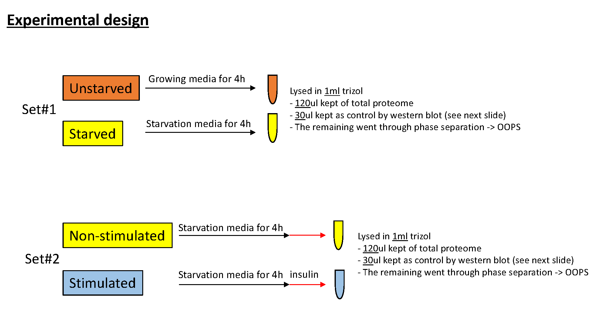

```{r global_options, echo=FALSE}
knitr::opts_chunk$set(fig.width=12,fig.height=8,warning=FALSE, message=FALSE,tidy = TRUE,tidy.opts=list(width.cutoff=50))
```
## 1. Introduction  
This is a large experiment by Veronica testing the effects of Insulin deprivation and stimulation on MCF10A "normal" breast cells that are highly dependent on insulin for their growth. The experimental set up is shown below. As you can see, there are 5 replicates for each conditions. Set1 and Set 2 have been analysed in two 10-plex TMT experiments on the mass spectrometer. Here, we would like to assess the differences in RNA-binding proteins, if any, in (1) Insulin-starved and (2) Insulin-stimulated cells relative to their controls.  

In the following lines of code, we will:  
 1. Look the raw data  
 2. Filter data to remove those mapping to multiple proteins  
 3. Aggregate the data into protein-level quantification  
 4. Filter the data to remove contaminants  
 5. Normalise the data (if needed)  
 6. Perform QC checks  
 7. Look for differentially expressed RBPs across conditions  
 8. Look for GO term enrichment in the differential RBPs  



***

We start by installing and loading the libraries required for our analysis. Make sure you have downloaded the GitHub repository https://github.com/TomSmithCGAT/CamProt_R locally. Also make sure you are in the directory that contains the Rmd notebooks prior to running this code, otherwise program will not run. Raw data is in the folder "../raw", plots will be printed out to the folder "../plots" and results in the form of tables will be printed out to the folder "../results". Large annotation files necessary for GO term enrichment are in the folder "../shared_files". 

```{r 00_Startup}

# Libraries needed for analysis
suppressMessages(library(MSnbase))
suppressMessages(library(dplyr))
suppressMessages(library(gridExtra))

# source file that contains useful functions for analysis
source("../../CamProt_R/Utility.R", chdir=TRUE)

# Source file that contains a list of glycoproteins that have been identified in previous OOPS experiments. I'm not convinced about removing these proteins from the study at the ourset.
glycoproteins <- read.table("../shared_files/glycoproteins.tsv", sep="\t", header=TRUE)
glycoproteins <- glycoproteins %>% pull(protein) %>% as.character() %>% unique()
```

```{r 01_Functions, eval = T, echo = F}

# A set of functions needed within this script.

#--------------------------------------------------------
# Function  : run_parse_features
# Aim       : Function-to-parse-features-for-all-data
#--------------------------------------------------------

run_parse_features <- function(fname){
  
  df = parse_features(fname,master_protein_col='Master.Protein.Accessions',protein_col='Master.Protein.Accessions')
  df_noglyc = df[!df$Master.Protein.Accessions %in% glycoproteins,]
  
  cat(sprintf("%s\tExcluding glycoproteins\n", length(rownames(df_noglyc))))
  cat(sprintf("\nThese peptides are associated with %s master proteins\n", 
              length(unique(df_noglyc$Master.Protein.Accessions))))
  
  return(list(df = df, df_noglyc = df_noglyc))
}

#----------------------------------------------------------------------------------
# Function  : assess_rbp_tot_overlap
# Aim       : quantify overlap between total protein and rbp (oops) experiments
#----------------------------------------------------------------------------------
assess_rbp_tot_overlap <- function(rbp_df, tot_df, suf){
  print(paste("RBP master proteins also in total",suf,"=",length(intersect(unique(tot_df$Master.Protein.Accessions),
                               unique(rbp_df$Master.Protein.Accessions))),sep=" "))
  print(paste("RBP master proteins NOT in total",suf,"=",
              length(setdiff(unique(rbp_df$Master.Protein.Accessions),
                             unique(tot_df$Master.Protein.Accessions)))))
  
  print(paste("Percentage RBP master proteins in total",suf,"=",round(length(intersect(unique(tot_df$Master.Protein.Accessions),unique(rbp_df$Master.Protein.Accessions)))*100/length(unique(rbp_df$Master.Protein.Accessions)),2),"%"))
}

#----------------------------------------------------------------------------------
# Function  : summariseMissing
# Aim       : print tally of missing values for each study across all peptides/prots
# Input     : 
#----------------------------------------------------------------------------------
summariseMissing <- function(res){
  #cat("\ntallies for missing data (# samples with missing)")
  print(table(rowSums(is.na(as.data.frame(exprs(res)))),dnn = "Number of peptides VS samples with missing values"))
}


#----------------------------------------------------------------------------------
# Function  : plotLabelQuant
# Aim       : Plot peptide abundance distributions for mass spectrometry data
#----------------------------------------------------------------------------------
plotLabelQuant <- function(obj, log=F, print=TRUE){
  tmp_df <- data.frame(exprs(obj))
  colnames(tmp_df) <- pData(obj)$Sample_name
  tmp_df[tmp_df==""] <- NA
  tmp_df <- melt(tmp_df, id.vars=NULL)
  tmp_df$value <- as.numeric(as.character(tmp_df$value))
  
  if(log){
    tmp_df$value = log(tmp_df$value,2)  
  }
  
  # Plotting functions
  p <- ggplot(tmp_df) + my_theme
  
  p1 <- p + geom_boxplot(aes(variable, value)) +
    theme(axis.text.x=element_text(angle=90, vjust=0.5, hjust=1,size=10),axis.title.y = element_text(size = 12), title = element_text(hjust = 0.5, vjust=0.5)) +
    ylab("Peptide intensity (log2) ") + xlab("") +
    scale_y_continuous(breaks=seq(-100,100,2))
  
  p2 <- p + geom_density(aes(value, col=variable),na.rm=T) +
    xlab("Peptide intensity (log2) ") + ylab("Density")+theme_classic()+theme(axis.title.y = element_text(size = 12),axis.title.x = element_text(size = 12),legend.title = element_text(size = 10),legend.position = c(0.9,0.5),legend.text = element_text(size = 8))+labs(col = "")+guides(color = guide_legend(override.aes = list(size = 0.4)))+scale_x_continuous(breaks=c(0,3,6,9,12))
  
  p3 = arrangeGrob(p1,p2,nrow=1)
  
  if(print){
    plot(p3)
  }
  
  return(list("p1"=p1, "p2"=p2, "p3"=p3))
}

#----------------------------------------------------------------------------------
# Function  : plotPepCounts
# Aim       : Plot distribution of peptide count per protein
#----------------------------------------------------------------------------------
plotPepCounts <- function(res_pep_agg){
  fData(res_pep_agg) <- fData(res_pep_agg)[,-grep("CV.*", colnames(fData(res_pep_agg)))]
  
  gb <- fData(res_pep_agg)$Master.Protein.Accessions
  gb <- factor(gb, levels = unique(gb))
  peptide_counts <- as.data.frame(table(gb))
  
  print(sprintf("Out of %s master proteins, we have %s one-hit wonder proteins (%s %%)",
                length(unique(gb)), sum(peptide_counts==1),
                round(100*sum(peptide_counts==1)/length(unique(gb)), 1)))
  
  titl = paste(unique(sapply(strsplit(pData(res_pep_agg)$Sample_name,"_"),"[[",1)),collapse=".vs.")
  p <- ggplot(peptide_counts, aes(log(Freq,2))) + geom_histogram() + my_theme +theme(axis.title.x=element_text(size=12),axis.title.y = element_text(size = 14),plot.title=element_text(hjust=0.5,vjust=1,size=18))+xlab("Log2(Number of peptides)")+ylab("Number of proteins")+labs(title = titl)
  return(p)
}

```
## 2. Read in the peptide-level quantification  
What we obtain following a mass spectrometer run is peptide-level quantification from Proteome Discoverer(PD). Here we perform some Quality Control checks before aggregating data to protein-level quantification. 

As discussed before, there are 2 sets of experiments that need to be analysed :  
a. Non-Insulin Stimulated (4hr-Starved) vs Insulin Stimulated (30min.Insulin) MCF10A cells  
b. Unstarved vs Starved (4hr-Starved) MCF10A cells  

The function 'parse_features' reads in a peptide-level data file and processes it remove any contaminants, peptides missing a protein assignment and those that are missing quantification values (details in 'Utility.R'). 

```{r 02_Peptide-level-quantification}
# Parsing input files
files = grep("reannot",list.files("../raw",full.names = T),value=T)
suff = gsub("_reannot.txt|_peptides","",sapply(strsplit(files,"/"),"[[",3))

# Process all experimental data
for(f in 1:length(files)){
  print(toupper(suff[f])) 
  r = run_parse_features(files[f])
  assign(paste(suff[f],"df",sep="_"),r$df)
  assign(paste(suff[f],"df_noglyc",sep="_"),r$df_noglyc)
}

# List objects that have been created
grep("df",ls(),value=T)

# Summarise the number of RBPs and Total proteins in each set of experiments

# 1. Non-insulin (4hr-Starved) vs Insulin Stimulated (30min-Insulin)
assess_rbp_tot_overlap(rbp_ni_df, total_ni_df, "N-vs-I")

# 2. Unstarved vs Starved (4hr-Starved)
assess_rbp_tot_overlap(rbp_us_df, total_us_df, "U-vs-S")
```
In the Non-Stimulated vs Insulin Stimulated experiments, nearly 80% of RBPs are also in the total samples. In the Unstarved vs Starved experiments, only about 70% of RBPs are also in the total samples. For most of the RBPs we will also have information regarding the changes in the total abundance for the protein, regardless of the abundance of the RNA-bound fraction. However, for 20-30% of them, we won't. 

## 3. Creating and working with MSnSets
First we create the dataframes to make an MSnSet object. It is based on a microarray eSet or ExpressionSet where the object contains slots with information and during data processing, the functions that work with MSnSets handle data within these slots as they expect very specific data types. The MSnSet has 3 main slots.  
a. exprs : Contains a dataframe of protein abundance values with samples in columns and proteins/peptides in rows  
b. fData : (feature Data)Contains annotation information about each of the proteins/peptides in the exprs dataframe. Can also include abundance information
c. pData : (phenotype Data) Contains annotation information about each sample in the exprs dataframe. Condition, replicate number, treatment type are all valid pieces of information.  

```{r 03_Creating-an-MSnSet-from-data}

# Read in experimental set-up data
samples_ni_inf <- "../raw/samples_ni.tsv"
samples_us_inf <- "../raw/samples_us.tsv"

total_ni_res <- makeMSNSet(total_ni_df, samples_ni_inf)
rbp_ni_res <- makeMSNSet(rbp_ni_df, samples_ni_inf)

total_us_res <- makeMSNSet(total_us_df, samples_us_inf)
rbp_us_res <- makeMSNSet(rbp_us_df, samples_us_inf)

# Check relative quantification in data
q1 <- plotLabelQuant(total_ni_res, log=T,print=F)
q2 <- plotLabelQuant(rbp_ni_res, log=T,print=F)
q3 <- plotLabelQuant(total_us_res, log=T,print=F)
q4 <- plotLabelQuant(rbp_us_res, log=T,print=F)

# Boxplots of raw data
g = grid.arrange(q1$p1,q2$p1,q3$p1,q4$p1,nrow=2)
#grid.arrange(q1$p2,q2$p2,q3$p2,q4$p2,nrow=2)
```

Once we've created MSnSets, we look at the distribution of abundance values on a per-sample basis keeping in mind that it is currently at the level of peptides. From the plots on the left, you can see that for the Total N_I experiment, 4hr-Starved_1 seems to have a different profile with more lowly expressed proteins than the remaining 9. For the Total & RBP U_S experiment, 4hr-Starved_4 seems to have strikingly lowly expressed proteins. It could be that slightly lower protein amount was mixed into the multiplex experiment for this replicate but need to chat to Rayner and Veronica about this.  

In general, the RBP experiments are more variable than the Total Proteome experiments but that is to be expected given the functioning RBPs in a snapshot of time can be different in each replicate experiment. Additionally, at least in the Straved-vs-Insulin treated experiments, the density curves of each treatment are shifted away from each other (squint a little bit!). If there is a convincing biological reason to do so, we would remove probelmatic samples - particularly replicate 4 in the Unstarved vs Starved experiment for both TotalProt and RBPs.  

### 3a. Aggregating over peptides
If you look at the fData slot in the MSnSets above, you will see that there is a column called "Sequence" that contains the sequence of the peptide whose abundance has been measured. Interestingly, there are some repeats of these sequences for the same protein that only differ in their Modifications i.e any amino acid modifications that the mass spectrometer has picked up. We will first aggregate over the peptides with the same sequence but different modifications so that we only have one peptide representing a given sequence. The abundance values are summed across different modifications. Note: Don't worry about the errors. Missing values are correctly handled here!!

```{r 3i_Aggregating-over-peptides}

# Aggregate to peptides
total_ni_res_pep_agg <- agg_to_peptides(total_ni_res)
rbp_ni_res_pep_agg <- agg_to_peptides(rbp_ni_res)
total_us_res_pep_agg <- agg_to_peptides(total_us_res)
rbp_us_res_pep_agg <- agg_to_peptides(rbp_us_res)

# Summarise missing values
summariseMissing(total_ni_res_pep_agg)
summariseMissing(rbp_ni_res_pep_agg)
summariseMissing(total_us_res_pep_agg)
summariseMissing(rbp_us_res_pep_agg)

# Save to RDS files for downstream use
saveRDS(total_ni_res_pep_agg, file="../results/total_ni_res_pep_agg.rds")
saveRDS(rbp_ni_res_pep_agg, file="../results/rbp_ni_res_pep_agg.rds")
saveRDS(total_us_res_pep_agg, file="../results/total_us_res_pep_agg.rds")
saveRDS(rbp_us_res_pep_agg, file="../results/rbp_us_res_pep_agg.rds")

```
You might have noticed that while we created the MSnSet, we also did a tally for how many samples had missing values across all of the peptides. Across the four studies, the number of peptides missing all 10 values in the 10-plex is shown in the table below. 

Experiment  | Raw peptide data | Aggregated peptide data  | 
------------|---------------------|-------------------------------------|
Total Insulin-Starved vs Stimulated | 4478 peptides |0 peptides |
RBPs Insulin-Starved vs Stimulated  | 2831 peptides |0 peptides |
Total Unstarved vs Starved  | 2990 peptides |0 peptides |
RBP Unstarved vs Starved  | 1856 peptides |0 peptides |  

Once we aggregate across modifications, there are no peptides where all 10 values are missing. They must have all been peptides with two or more alternate modifications that have now been rolled into one. However, there are still a small number of peptides that have some missing values but mostly in one or 2 samples only as shown in the plot below. The grey bars display missing values and black display non-missing values.Samples with most number of missing values mostly seem to correspond to those that stick out in the PCA plots in the next notebook. 


```{r 3ii-Plot-missing-data-at-peptide-level}

names = c("TotalProt-Non-Insulin-vs-Insulin-Stimulated","RBPs-Non-Insulin-vs-Insulin-Stimulated","TotalProt-Unstarved-vs-Starved","RBPs-Unstarved-vs-Starved")
c = 1

pdf("../plots/Missing-value-heatmaps-peptide-level-data.pdf",paper="a4r",width=14,height=8)

for(i in list(total_ni_res_pep_agg,rbp_ni_res_pep_agg,total_us_res_pep_agg,rbp_us_res_pep_agg)){
  if(length(summariseMissing(i))>=3){
    plotMissing(i,cexCol=0.8,srtCol=45,main = names[c])
  }
  c = c+1
}
dev.off()
```

Since we want to aggregate peptides into proteins, we check initially to see how many peptides we have per protein. We are particularly interested in the proportion of "one-hit" or "single-hit" across the samples as these would generally be low-confidence finds. 

```{r 3iii-Plot-peptide-vs-protein-count}

# Use function 'plotPepCounts' to plot distribution over peptide level data
p1=plotPepCounts(total_ni_res_pep_agg)
p2=plotPepCounts(rbp_ni_res_pep_agg)
p3=plotPepCounts(total_us_res_pep_agg)
p4=plotPepCounts(rbp_us_res_pep_agg)

pdf("../plots/Distribution-of-peptides-per-protein.pdf",paper="a4r",width=14,height=8)
grid.arrange(p1,p2,p3,p4,nrow=2)
dev.off()
```
So we have 13-19% "one-hit" wonders across the 4 experiments (NI - Total (15.7%),RBP (17.8%); US - Total(12.5%),RBP(18.5%)). We'll leave these in for now but we could consider excluding these as we have less confident abundance estimates here. 

### 3b. Aggregating over proteins
Having aggregated across peptides with multiple modifications, we now was an abundance value per protein per samples. To achieve this, we need to aggregate again, this time using Uniprot IDs to identify all peptides that belong to a single protein and summing abundance values across these peptides to get a single value for a given protein. Following this, we once again do a tally for missing values at the protein level. 

```{r 3iv-Aggregating-over-proteins}

# Aggregate to protein
total_ni_res_pro_agg <- agg_to_protein(total_ni_res_pep_agg, "Master.Protein.Accessions")
rbp_ni_res_pro_agg <- agg_to_protein(rbp_ni_res_pep_agg, "Master.Protein.Accessions")
total_us_res_pro_agg <- agg_to_protein(total_us_res_pep_agg, "Master.Protein.Accessions")
rbp_us_res_pro_agg <- agg_to_protein(rbp_us_res_pep_agg, "Master.Protein.Accessions")

# Summarise missing values
summariseMissing(total_ni_res_pro_agg)
summariseMissing(rbp_ni_res_pro_agg)
summariseMissing(total_us_res_pro_agg)
summariseMissing(rbp_us_res_pro_agg)
```
Note, we're now down to very few missing values and that too in very few samples (1,2,4 out of 10). So few that we could remove these proteins entirely (0/2792 Total NI proteins; 1/1399 RBP NI proteins; 3/2805 for Total US proteins, 33/1048). Since at most we are only missing 3% of values, we will keep proteins with missing values in for now. We might consider removing them later. 

```{r 3v-Plot-missing-data-at-protein-level}

names = c("TotalProt-Non-Insulin-vs-Insulin-Stimulated","RBPs-Non-Insulin-vs-Insulin-Stimulated","TotalProt-Unstarved-vs-Starved","RBPs-Unstarved-vs-Starved")
c = 1

pdf("../plots/Missing-value-heatmaps-protein-level-data.pdf",paper="a4r",width=14,height=8)

for(i in list(total_ni_res_pro_agg,rbp_ni_res_pro_agg,total_us_res_pro_agg,rbp_us_res_pro_agg)){
  if(length(summariseMissing(i))>=3){
    plotMissing(i,cexCol=0.8,srtCol=45,main = names[c])
  }
  c = c+1
}
dev.off()
```
Having carried on with missing values, they do cause trouble at the PCA level so I'm going to replace missing values with the smallest non-missing value (min) in the dataset. For the Total NI dataset, this has no impact. For the RBP NI dataset, this changes one value. For the Total US dataset, this changes 6 values and for the RBP US dataset, 34 values are set to 'min' of which 32 are missing only from one sample (4hr Starved, Rep 4). I'm using the MSnBase 'impute' function here for ease of use. 

```{r 3vi-Impute-proteins-with-missing-values}
total_ni_res_pro_agg <- MSnbase::impute(total_ni_res_pro_agg, method = "min")
rbp_ni_res_pro_agg <- MSnbase::impute(rbp_ni_res_pro_agg, method = "min")
total_us_res_pro_agg <- MSnbase::impute(total_us_res_pro_agg, method = "min")
rbp_us_res_pro_agg <- MSnbase::impute(rbp_us_res_pro_agg, method = "min")

summariseMissing(total_ni_res_pro_agg)
summariseMissing(rbp_ni_res_pro_agg)
summariseMissing(total_us_res_pro_agg)
summariseMissing(rbp_us_res_pro_agg)

# Save to RDS files for downstream use
saveRDS(total_ni_res_pro_agg, file="../results/total_ni_res_pro_agg.rds")
saveRDS(rbp_ni_res_pro_agg, file="../results/rbp_ni_res_pro_agg.rds")
saveRDS(total_us_res_pro_agg, file="../results/total_us_res_pro_agg.rds")
saveRDS(rbp_us_res_pro_agg, file="../results/rbp_us_res_pro_agg.rds")
```

### 3c. Normalising data
Next, we log center normalise the data. The total amount of peptide labelled in each sample should be the same so we can assume any difference in the total intensity per tag is due to inaccuracies in peptide quantification prior to labelling, pipetting etc, or non-identical labelling efficiencies. Whatever the cause, we can normalise the tags since we want to obtain a relative measure between tags. 

So we log centre normalise the data first. This leaves us with the median abundance for each sample at 0 and values below or above median for the proteins analysed in that samples. To these values, we add the median of all protein abundance values (a constant) which then shifts the range of values into the positive range making it more interpretable. The plots below show protein abundance data before and after normalisation.

```{r 3vii-Normalise-data}

# Median central normalise
total_ni_res_pro_agg_norm <- logCenterNormalise(total_ni_res_pro_agg)
exprs(total_ni_res_pro_agg_norm) <- exprs(total_ni_res_pro_agg_norm) + median(log2(exprs(total_ni_res_pro_agg)),na.rm=T)
  
rbp_ni_res_pro_agg_norm <- logCenterNormalise(rbp_ni_res_pro_agg)
exprs(rbp_ni_res_pro_agg_norm) <- exprs(rbp_ni_res_pro_agg_norm) + median(log2(exprs(rbp_ni_res_pro_agg)),na.rm=T)

total_us_res_pro_agg_norm <- logCenterNormalise(total_us_res_pro_agg)
exprs(total_us_res_pro_agg_norm) <- exprs(total_us_res_pro_agg_norm) + median(log2(exprs(total_us_res_pro_agg)),na.rm=T)
  
rbp_us_res_pro_agg_norm <- logCenterNormalise(rbp_us_res_pro_agg)
exprs(rbp_us_res_pro_agg_norm) <- exprs(rbp_us_res_pro_agg_norm) + median(log2(exprs(rbp_us_res_pro_agg)),na.rm=T)

# Create plots
pa <- plotLabelQuant(total_ni_res_pro_agg, log=TRUE,print=F)
pb <- plotLabelQuant(total_ni_res_pro_agg_norm, log=FALSE,print=F)

pc <- plotLabelQuant(rbp_ni_res_pro_agg, log=TRUE,print=F)
pd <- plotLabelQuant(rbp_ni_res_pro_agg_norm, log=FALSE,print=F)

pe <- plotLabelQuant(total_us_res_pro_agg, log=TRUE,print=F)
pf <- plotLabelQuant(total_us_res_pro_agg_norm, log=FALSE,print=F)

pg <- plotLabelQuant(rbp_us_res_pro_agg, log=TRUE,print=F)
ph <- plotLabelQuant(rbp_us_res_pro_agg_norm, log=FALSE,print=F)

# Draw combined plot
pdf("../plots/Density-plots-before-after-normalisation.pdf",paper="a4r",width=14,height=8)
grid.arrange(pa$p2,pb$p2,pc$p2,pd$p2,pe$p2,pf$p2,pg$p2,ph$p2,nrow=4)
dev.off()

pdf("../plots/Boxplots-BEFORE-normalisation.pdf",paper="a4r",width=14,height=8)
grid.arrange(pa$p1,pc$p1,pe$p1,pg$p1,nrow=2)
dev.off()

pdf("../plots/Boxplots-AFTER-normalisation.pdf",paper="a4r",width=14,height=8)
grid.arrange(pb$p1,pd$p1,pf$p1,ph$p1,nrow=2)
dev.off()

# Save normalised, protein level data 
saveRDS(total_ni_res_pro_agg_norm, file="../results/total_ni_res_pro_agg_norm")
saveRDS(rbp_ni_res_pro_agg_norm, file="../results/rbp_ni_res_pro_agg_norm")
saveRDS(total_us_res_pro_agg_norm, file="../results/total_us_res_pro_agg_norm")
saveRDS(rbp_us_res_pro_agg_norm, file="../results/rbp_us_res_pro_agg_norm")
```
From this step, we move on to further QC of the datas using principal components analysis for dimensionality reduction. The main takeaway from this first analysis notebook is that Replicate 4 in the Unstarved vs Starved experiment is a bit ropey, particularly in the RNA binding protein setting. 


Notes:
------
Things to do with this notebook before closing it  
1. Evaluate functions but leave them out of the output  
2. Modify function 'summariseMissing' and 'makeMSNSet' to be less verbose  
3. Change plotLabel  
