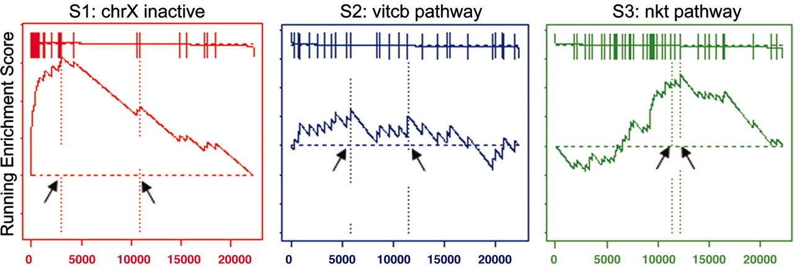

```{r global_options, echo=FALSE}
knitr::opts_chunk$set(fig.width=8,fig.height=6,warning=FALSE, message=FALSE,tidy = TRUE,tidy.opts=list(width.cutoff=50))
```
## 1. Introduction 
Since we don't have any unifying functional themes for the proteins in our analysis, we use Gene Set Enrichment Analysis (GSEA) to work out if there are any genesets with which are data aligns. The goal of GSEA is to determine whether members of a gene set S (in our case proteins with p-value < 0.05), tend to occur toward the top (or bottom) of the list L, in which case the gene set is correlated with the phenotypic class distinction. In our case, this list L could be things like "Amino acyl transferase genes", "Unfolded protein response genes" and so on. 

As a process, we would first rank our list of DE genes either by fold change or by p-value or by log odds score (B) and then pick a gene set we are interested in comparing it to eg: AAtransferases. We start at the top of our ranked list. If the protein at the top of our list is in the AAtransferase list, then a positive number gets added to the running total score. Then we move to the next protein and if that one is also in the AAtransferase list, the score goes up, else the score goes down. Hence you see the craggy peaks in the line graphs depicted below. The vertical bars in the flat line at the top of each of the figures below represent a protein/gene from our list. 



GSEA then provides an enrichment score which reflects the extent to which our dataset is represented at the start (top) or end (bottom) of the list L. If we see majority of our genes are  
1. at the top of a list, then the score is high and we can say that our list is significantly enriched for that term (S1 above)  
2. at the bottom of a list, then our data is significantly depleted for that term  
3. scattered randomly, then the score is generally low and we have no significant enrichment (S2 above)   
4. in the middle of the list but enriched, then the score is lower than at when at either end of the list and may not be significant (S3 above)  

The enrichment score is then normalised and a significance level for the enrichment score is derived using permutation testing. This significance level is then corrected for multiple-hypotheses. Overall we get an enrichment score(ES), a normalised enrichment score (NES), a pvalue (pva), an adjusted pvalue (padj) which we can use to interpret the data.

```{r 00_Functions-libraries-needed, eval=T, echo=F, warning=F}

# Libraries
library(tidyr)
library(dplyr)
library(gage)
library(fgsea)
library(ggplot2)
library(wgutil)
library(ggrepel)
library(gridExtra)

#-------------------------------------------------------------
# Function  : plot_foi_trends
# Aim       : Function to plot Features of Interest (foi)
#--------------------------------------------------------------
plot_foi_trends <- function(obj, foi){
  foi_proteins <- all_go[[foi]]
  
  # Subset stats for the list of proteins
  sub <- obj %>%
    mutate(sig=ifelse(adj.P.Val<0.1, "sig.", "not sig.")) %>% # add "sig" column
    mutate(foi=Master.Protein.Accessions %in% foi_proteins) %>%
    arrange(foi)
  sub$gene.name = gsub(" ","",sapply(strsplit(sub$Master.Protein.Descriptions,"GN=|PE"),"[[",2))
  
  # ggplot object  
  p = ggplot(sub, aes(logFC, -log10(P.Value), colour=sig, shape=foi)) +
    geom_point() +
    scale_colour_manual(values=c("darkturquoise","orchid"),name="Sig. (10% FDR)") +# manually adjust colours
    scale_shape_manual(values=c(17,8),name="Feature of Interest") +
    scale_size_manual(values=c(2,4))+
    theme(legend.position = "top")+
    ggtitle(foi)
  
  # Add gene names
  p = p+geom_text_repel(data=sub %>% filter(Master.Protein.Accessions %in% foi_proteins & sig=="sig."), aes(label=gene.name), size=3,colour="black")
  
  # Create GSEA line graph
  q = plotEnrichment(all_go[[foi]], ranks) + ggtitle(foi)
  
  # Plot both graphs
  grid.arrange(p,q,nrow=1,ncol=2)
  
  invisible(p)
}
```

```{r 01_Reading-in-data}

Ctrl.100uM <- readRDS("../results/Ctrl.100uM.rds")
Ctrl.400uM <- readRDS("../results/Ctrl.400uM.rds")
#Ctrl.400uM[,45:52] %>% tibble::rownames_to_column() %>% arrange(desc(logFC))
#Ctrl.400uM[,45:52] %>% arrange(desc(logFC)) %>% tail()
#head(Ctrl.400uM)

human_go <- readRDS("../shared_files/h_sapiens_go_full.rds")
```

```{r 02_Setting-up-gene-sets, echo = T, eval = F}

# Gene sets of interest
translation_init_activity <- human_go %>% filter(GO.ID=='GO:0003743') %>% pull(UNIPROTKB)
translation_elong_activity <- human_go %>% filter(GO.ID=='GO:0003746') %>% pull(UNIPROTKB)
translation_term_activity <- human_go %>% filter(GO.ID=='GO:0008079') %>% pull(UNIPROTKB)
tRNA_AA <- human_go %>% filter(GO.ID=='GO:0004812') %>% pull(UNIPROTKB)
translocon <- human_go %>% filter(GO.ID=='GO:0006616') %>% pull(UNIPROTKB)

# GO terms of interest (gotoi)
gotoi <- list(translation_init_activity, translation_elong_activity,
              translation_term_activity, tRNA_AA, translocon )

names(gotoi) <- c('GO_0003743_Initiation', 'GO:0003746:Elongation', 'GO:0008079:Translation', 'GO:0004812:tRNA-AA', 'GO:0006616:Translocon')
print(gotoi)

# Gene set for each GO term
# The set of GO terms is same for both Ctrl.400uM and Ctrl.100uM) as it is the same set of proteins that were analysed using TMT

all_go_terms <- human_go %>% filter(UNIPROTKB %in% rownames(Ctrl.400uM)) %>%
  pull(TERM) %>% unique()

all_go <- vector("list", length=length(all_go_terms))
names(all_go) <- all_go_terms

for(x in all_go_terms){
  all_go[[x]] <- human_go %>% filter(TERM==x) %>% pull(UNIPROTKB)
}

print(head(all_go,1))
saveRDS(all_go,"../results/all_go.rds")

# Plot enrichment for our own defined genesets
#lapply(gotoi, function(x) plotEnrichment(x, ranks))
```


```{r 03_Gene-set-enrichment-analysis}

all_go = readRDS("../results/all_go.rds")

# Ranking the 100uM dataset using logFC
ranks <- rev(sort(Ctrl.100uM$logFC))
names(ranks) <- rownames(Ctrl.100uM)
head(ranks)

# Plot log fold changes
# Can see genes at both ends of spectrum - up and downregulated after arsenite treatment. 
# We have the up-regulated ones at the top. 
par(mfrow=c(1,2))
barplot(ranks,las=2,cex.names=0.1)
plot(ranks)
par(mfrow=c(1,1))

# Run a pre-ranked GSEA against all known GO terms
fgseaRes <- fgsea(all_go, ranks, minSize=15, maxSize = 500, nperm=1000)
head(fgseaRes[order(pval, -abs(NES)), ], n=10)

# Select the top-10 go terms and plot enrichment for them
head(fgseaRes[order(pval, -abs(NES)), ], n=10)$pathway %>% lapply(function(x){
  plotEnrichment(all_go[[x]], ranks) + ggtitle(x)
})


```
## 4. Assessing hits
Here we are trying to look at the ranking+enrichment for our terms of interest. We start by looking at which terms are represented in our data

```{r 04_Assessing-hits}
fgseaRes %>% arrange(pval) %>% filter(grepl("Ribosome", pathway, ignore.case=TRUE))
fgseaRes %>% arrange(pval) %>% filter(grepl("Endoplasmic", pathway, ignore.case=TRUE))
fgseaRes %>% arrange(pval) %>% filter(grepl("Translation", pathway, ignore.case=TRUE))
```
##£ 4b. Plotting enrichment plots of interest
We draw a volcano plot and en enrichment plot showing the terms enriched and the genes that contribute to the enrichment

```{r 4b. Enrichment-plots-of-interest}

# 100uM
plot_foi_trends(Ctrl.100uM, 'regulation of translation')
plot_foi_trends(Ctrl.100uM, 'tRNA aminoacylation for protein translation')
plot_foi_trends(Ctrl.100uM, 'structural constituent of ribosome')
plot_foi_trends(Ctrl.100uM, 'endoplasmic reticulum unfolded protein response')

#400uM
plot_foi_trends(Ctrl.400uM, 'regulation of translation')
plot_foi_trends(Ctrl.400uM, 'tRNA aminoacylation for protein translation')
plot_foi_trends(Ctrl.400uM, 'structural constituent of ribosome')
plot_foi_trends(Ctrl.400uM, 'endoplasmic reticulum unfolded protein response')

```


```{r 4c. Ranking-top-enriched-depleted-genesets}

topUp <- fgseaRes %>% 
    filter(ES > 0) %>% 
    top_n(10, wt=-pval)

topDown <- fgseaRes %>% 
    filter(ES < 0) %>% 
    top_n(10, wt=-pval)

topPathways <- bind_rows(topUp, topDown) %>% 
    arrange(-ES)


x <- plotGseaTable(all_go[topPathways$pathway], gseaParam = 0.5, ranks, fgseaRes)
#str(x)
```
